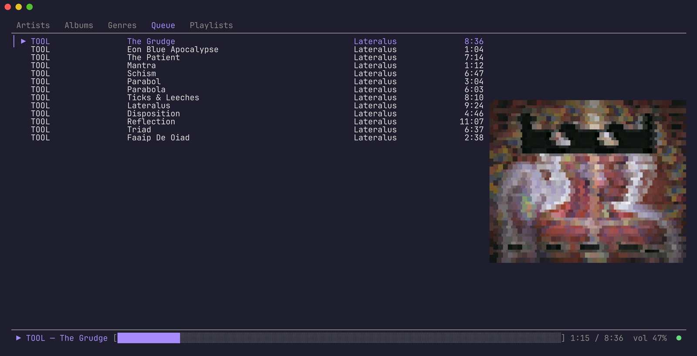
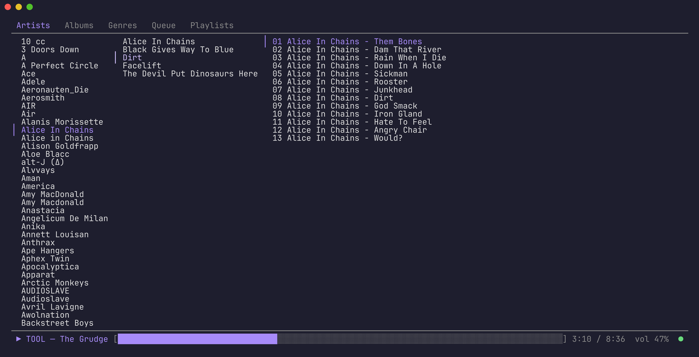
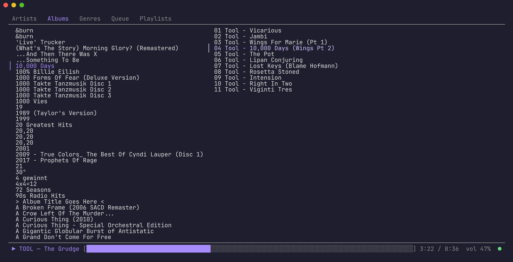
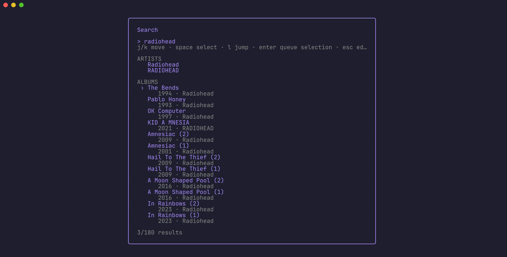

# mpdtui

A full-screen, keyboard-driven terminal client for [MPD](https://www.musicpd.org/),
with vim-style navigation and ranger-style Miller columns for browsing your
library by artist, album, genre, and stored playlist.

It speaks MPD's protocol directly (no libmpdclient, no cgo), stays in sync
through MPD's `idle` notifications, and renders the now-playing cover art
(`albumart` / embedded `readpicture`) in the terminal.



| Artists (Miller columns) | Albums |
|---|---|
|  |  |



## Install

```sh
go install github.com/unixmonks/mpdtui@latest
```

## Usage

```sh
mpdtui                        # localhost:6600
mpdtui -host music.lan -port 6600
MPD_HOST=secret@music.lan mpdtui
MPD_HOST=/run/mpd/socket mpdtui
```

| Flag     | Env            | Meaning                                                    |
|----------|----------------|------------------------------------------------------------|
| `-host`  | `MPD_HOST`     | host, `password@host`, unix socket path, or `@abstract`    |
| `-port`  | `MPD_PORT`     | TCP port (default 6600)                                    |
| `-keys`  | `MPDTUI_KEYS`  | TOML file of key overrides (and an optional `[theme]`)     |
| `-theme` | `MPDTUI_THEME` | built-in theme; `ctrl+t` picks one live                    |

## Keys

Press `?` in the app for the full list. Highlights:

| Key            | Action                                               |
|----------------|------------------------------------------------------|
| `1`–`5`, `tab` | Artists / Albums / Genres / Queue / Playlists        |
| `j`/`k`, `h`/`l` | move, back out / drill in                          |
| `enter`        | play (replaces the queue from the selection onward) |
| `a`            | append track/album/artist/genre/playlist to queue    |
| `A`            | add track to a stored playlist (created if new)      |
| `dd`           | remove from queue / playlist                         |
| `D`            | clear queue                                          |
| `J`/`K`        | move queue entry down / up                           |
| `space`        | play / pause                                         |
| `n`/`p`        | next / previous                                      |
| `+`/`-`, `m`   | volume, mute                                         |
| `s`, `r`       | shuffle (random), repeat off → all → one             |
| `ctrl+k`       | search                                               |
| `/`            | filter current list                                  |
| `U`            | update MPD's database                                |
| `c`            | toggle cover art                                     |

Every binding can be remapped in the `-keys` TOML file; field names are in
`keyconfig.go` (e.g. `clear_queue = ["D"]`, `update_db = ["U"]`).

## Notes

- Albums are identified by their (AlbumArtist, Album) tags, with MPD's usual
  fallback to Artist when AlbumArtist is missing.
- MPD has no mute, so `m` remembers the volume, sets it to 0, and restores
  it on unmute.
- Repeat "one" maps to MPD's `repeat 1` + `single 1`.

## Development

```sh
go test ./...
# integration test against a scratch MPD (it rewrites the queue):
MPDTUI_TEST_ADDR=127.0.0.1:6601 go test -run Live -v ./...
```
